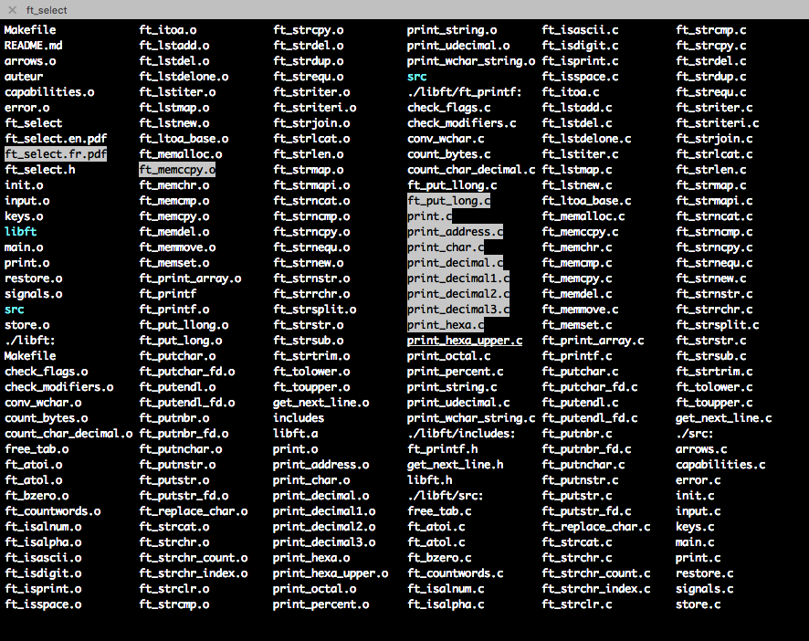

# ft_select

A program using the termcaps library to display a list of arguments and return those the user has selected to the shell.

Usage: ./ft_select [list of arguments]

Use the arrow keys to move through the list, space key to select/unselect an element, return to send the selected elements to the shell or escape to exit.

